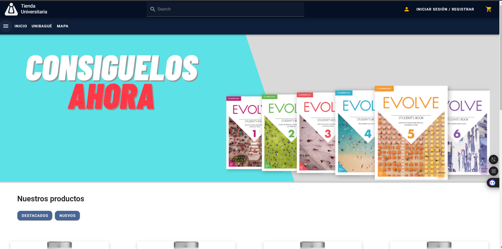

# 🎓 Tienda Universitaria




## 📜 Descripción del Proyecto

Este proyecto es una tienda en línea desarrollada para estudiantes de la Universidad de Ibagué como parte de su proyecto de grado. La tienda ofrece productos como libros, termos, papelería y ropa. La plataforma permite a los usuarios:
📂 Navegar por categorías
🛒 Agregar productos al carrito
💳 Realizar compras de forma rápida y eficiente

## 🚧 Estado del proyecto

El proyecto está en fase de desarrollo activo con varias funcionalidades ya implementadas, como la vista de productos, carrito de compras, y pasarela de pago.

## 🌐 Acceso al Proyecto

Puedes acceder al proyecto clonando este repositorio y siguiendo las instrucciones de instalación más abajo.

## ⚙️ Instrucciones de instalación

1. **Instala Node.js**:
   Si no tienes Node.js instalado, puedes descargarlo e instalarlo desde [aquí](https://nodejs.org). Asegúrate de instalar la versión LTS (soporte a largo plazo) recomendada.

   Para verificar que se haya instalado correctamente, ejecuta en tu terminal:

   ```bash
   node -v
   ```

2. **Clona el repositorio**

   ```bash
   git clone https://github.com/usuario/tienda-universitaria.git
   ```

3. **instala las dependencias**
   Una vez clonado el repositorio, navega al directorio del proyecto e instala las dependencias necesarias usando npm:

   ```bash
   cd tienda-universitaria
   npm install
   ```

4. **Inicia el servidor de desarrollo:**
   Después de la instalación de dependencias, ejecuta el siguiente comando para iniciar la aplicación localmente:

   ```bash
   npm run dev # para modo desarrollo
   ```

5. **Accede al proyecto**
   Una vez iniciado el servidor, puedes acceder a la aplicación en 🌍 http://localhost:8080 (localmente).

## 🛠️ Tecnologias usadas
🖼️ Vue.js
🎨 Vuetify 3
🟢 Node.js
📦 NPM

## 👥 Personas Contribuyentes
Este proyecto está siendo desarrollado actualmente por una sola persona.

## 💻 Personas Desarrolladoras del Proyecto
Manuel Caicedo:
🧩 GitHub: https://github.com/Konan03
📧 Email: manuelcaicedo52@gmail.com
⏺️ Linkedin: https://www.linkedin.com/in/jose-manuel-caicedo-perdomo/